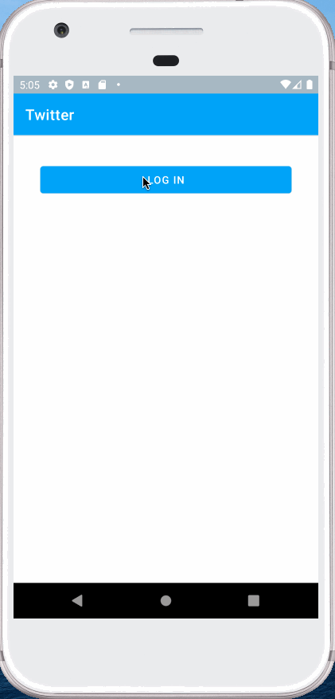

# Project 3 - *Twitter*

**Twitter** is an android app that allows a user to view their Twitter timeline and post a new tweet. The app utilizes [Twitter REST API](https://dev.twitter.com/rest/public).

Time spent: **12** hours spent in total

## User Stories

The following **required** functionality is completed:

* [x]	User can **sign in to Twitter** using OAuth login
* [x]	User can **view tweets from their home timeline**
  * [x] User is displayed the username, name, and body for each tweet
  * [x] User is displayed the [relative timestamp](https://gist.github.com/nesquena/f786232f5ef72f6e10a7) for each tweet "8m", "7h"
* [x] User can **compose and post a new tweet**
  * [x] User can click a “Compose” icon in the Action Bar on the top right
  * [x] User can then enter a new tweet and post this to twitter
  * [x] User is taken back to home timeline with **new tweet visible** in timeline
  * [x] Newly created tweet should be manually inserted into the timeline and not rely on a full refresh
* [x] User can **see a counter with total number of characters left for tweet** on compose tweet page
* [x] User can **pull down to refresh tweets timeline**
* [x] User can **see embedded image media within a tweet** on list or detail view.

The following **stretch** features are implemented:

* [x] User is using **"Twitter branded" colors and styles**
* [ ] User sees an **indeterminate progress indicator** when any background or network task is happening
* [ ] User can **select "reply" from detail view to respond to a tweet**
  * [ ] User that wrote the original tweet is **automatically "@" replied in compose**
* [x] User can tap a tweet to **open a detailed tweet view**
  * [x] User can **take favorite (and unfavorite) or reweet** actions on a tweet
* [x] User can view more tweets as they scroll with infinite pagination
* [ ] Compose tweet functionality is build using modal overlay
* [ ] User can **click a link within a tweet body** on tweet details view. The click will launch the web browser with relevant page opened.
* [x] Use Parcelable instead of Serializable using the popular [Parceler library](http://guides.codepath.org/android/Using-Parceler).
* [ ] Replace all icon drawables and other static image assets with [vector drawables](http://guides.codepath.org/android/Drawables#vector-drawables) where appropriate.
* [ ] User can view following / followers list through any profile they view.
* [ ] Use the View Binding library to reduce view boilerplate.
* [ ] On the Twitter timeline, leverage the [CoordinatorLayout](http://guides.codepath.org/android/Handling-Scrolls-with-CoordinatorLayout#responding-to-scroll-events) to apply scrolling behavior that [hides / shows the toolbar](http://guides.codepath.org/android/Using-the-App-ToolBar#reacting-to-scroll).
* [ ] User can **open the twitter app offline and see last loaded tweets**. Persisted in SQLite tweets are refreshed on every application launch. While "live data" is displayed when app can get it from Twitter API, it is also saved for use in offline mode.

The following **additional** features are implemented:

* [x] Implemented Material Design to my code

## Video Walkthrough

Here's a walkthrough of implemented user stories:

GIF created with [LiceCap](http://www.cockos.com/licecap/).

## Notes

A few chalenges I encountered was displaying the embedded media and accessing the media. But once I entered the stretch goals, I ultimately got stuck trying to allow the user to view the retweet on their own timeline.
